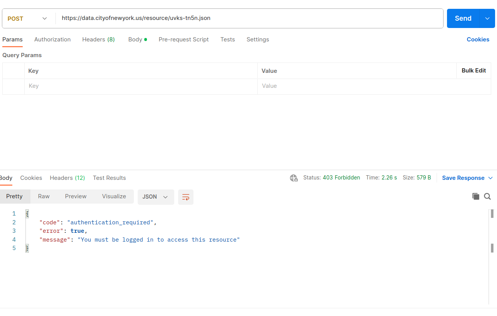
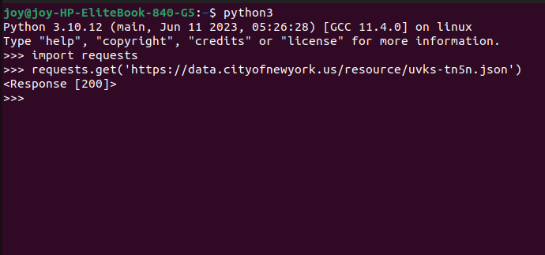
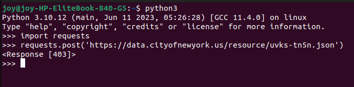

# Testing API documentation
The public api we are using is: `https://data.cityofnewyork.us/resource/uvks-tn5n.json`

## Testing with postman
### Testing GET requests
* Enter the URL in the field and click send:

You'll see we receive a JSON object as a response and a status code of 200.

### Testing post requests
We can also test whether the API supports POST requests
* Enter the URL in the field and select post.
* Click send.

You will receive a status code of 403 forbidden.This shows that the api does not supports POST requests.

##  Testing using python shell.
### Testing GET requests.
* Open the shell `python3`
* Enter the following in the shell:
```python
import requests
```
```python
requests.get('https://data.cityofnewyork.us/resource/uvks-tn5n.json')
```

* You will receive a response of  response code 200.This shows that the api supports GET requests.

### Testing POST requests.
* Open the shell `python3`
* Enter the following in the shell:
```python
import requests
```
```python
requests.post('https://data.cityofnewyork.us/resource/uvks-tn5n.json')
```

* You will receive a response of  response code 403.This shows that the api does not support POST requests.

